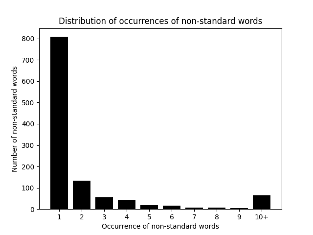
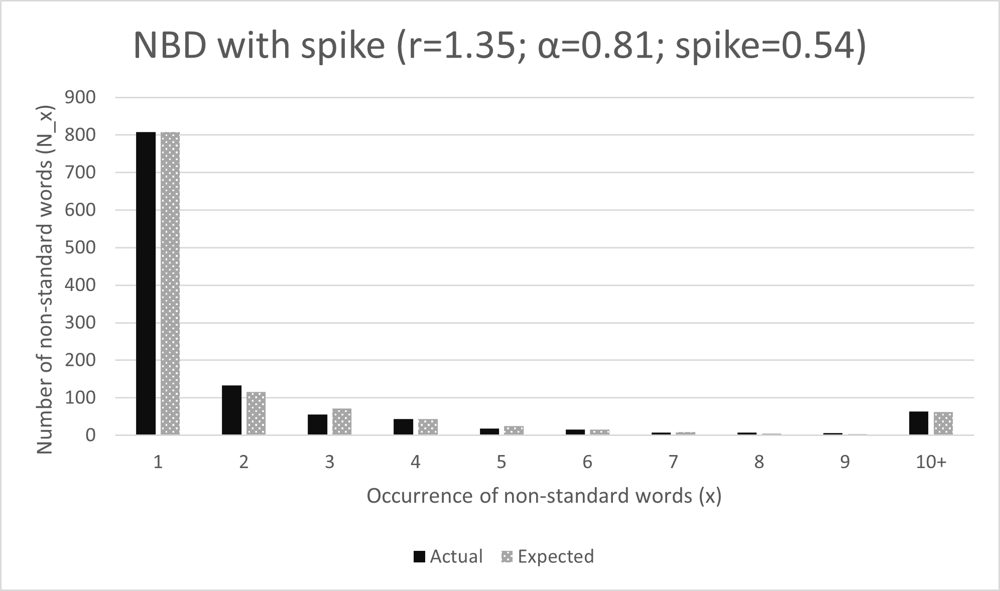

# Dataset description

The dataset is called `lexnorm2015.tgz` (568 KB) and comes from [here](https://noisy-text.github.io/2015/norm-shared-task.html). Once extracted, it produces three json files: `train_data.json` (869 KB), `test_data.json` (325 KB), and `test_truth.json` (577 KB). We are interested in the first and last files, since `test_data.json` does not include target outputs for test inputs. This is currently in the Original Data folder. We converted the data to text files and are now labelled as `train.txt` and `test.txt` 

In total, we have 2950 training tweets and 1967 test tweets, which represents a 60:40 split. We do not use a validation set because neither of our extensions involve hyper parameter tuning.

These `.json` files contain an array of dictionaries, each of which contains the (X, y) pair for a single tweet. A sample dictionary follows
```
{
  "tid":"469964934877810688",
  "index":"2401",
  "output":["@ez_doesssit","yeah","but","still","that's","wild","laughing out loud"],
  "input":["@Ez_DoesssIt","yeh","but","still","that's","wild","lol"]
}
```
In the above example, "yeh" has been mapped to "yeah" and "lol" to "laughing out loud". The @handle has also been lowercased.

A sample of some of the most common non-standard words follows. The n-word was fairly common and was omitted from this writeup but will be included in future reports.

| Non-standard word | Train | Test |
| ----------------- | ----- | ---- |
| u                 | 333   | 236  |
| lol               | 272   | 197  |
| im                | 182   | 154  |
| dont              | 92    | 57   |
| omg               | 67    | 34   |

This directory also contains two `*.png` files that provide another view into the data.

`distr.png` shows the distribution of occurrences of non-standard words. The interpretation is that _many_ (~800) non-standard words occurred only once in the training data. It is easy to understand why: there are many unique ways to represent a particular standard word! For example, "smilee", "smileee", "smileeeee" all map to "smile". This figure reveals the challenge of working with this data. The training data contains mostly single instances of non-standard words.


`nbd.png` shows a probability model called the Negative Binomial Distribution model fit to the data from the first figure. The model has a chisqure p-value of 0.04, indicating that the model parameters produce an excellent fit. The artificial probability spike of 0.54 at 1 shows that the model is able to account for only half of the probability mass at 1. In other words, from the model's perspective, half of the words that only occur once are due to some force exogenous to the underlying distribution of the rest of the counts.
